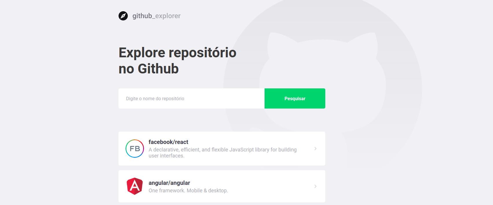

<h1>
  
</h1>

<h2 align="center">Primeiro projeto com React</h2>

### 📃 Sobre

A aplicação foi desenvolvida na aula sobre React no bootcamp GoStack da Rocketseat. O **Explore repositório no Github** é uma aplicação web onde o usuário pode pesquisar por repositórios no Github bastando para isso inserir no campo de busca no seguinte formato `node-do-usuário/nome-repositório`, exemplo: **facebook/react-native**.<br />
Clicando no repositório apresentado em tela é possível ter acesso a todas as issues lidas à aquele repositório.

### ⚒️ Tecnologias utilizadas

- [React](https://pt-br.reactjs.org/)
- [TypeScript](https://www.typescriptlang.org/)
- [StyledComponent](https://styled-components.com/)
- [Eslint](https://eslint.org/)
- [Prettier](https://prettier.io/)

### 🖥 Como baixar o projeto
```Bash
# Clone o repositório
# usando ssh
git clone git@github.com:heliton1988/primeiro-projeto-react.git

# usando HTTP
git clone https://github.com/heliton1988/primeiro-projeto-react.git
```

É necessário ter o **yarn** instalado

### 🚀 Para rodar o projeto
```Bash
# Dentro da pasta do projeto rode o seguinte comando:
yarn

# Ainda dentro da pasta do projeto rode:
yarn start
```

<p align="center">Com 💙 <a href="https://www.linkedin.com/in/helitonoliveira/" target="_blank" style="color: #3d3d4d;">Héliton Oliveira</a></p>
