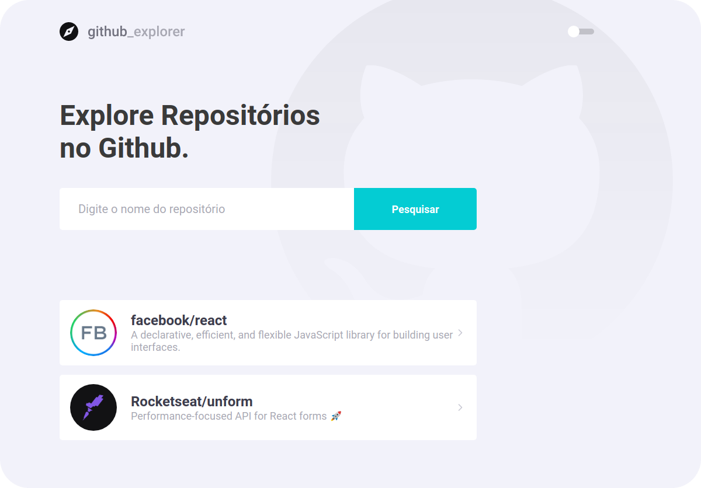
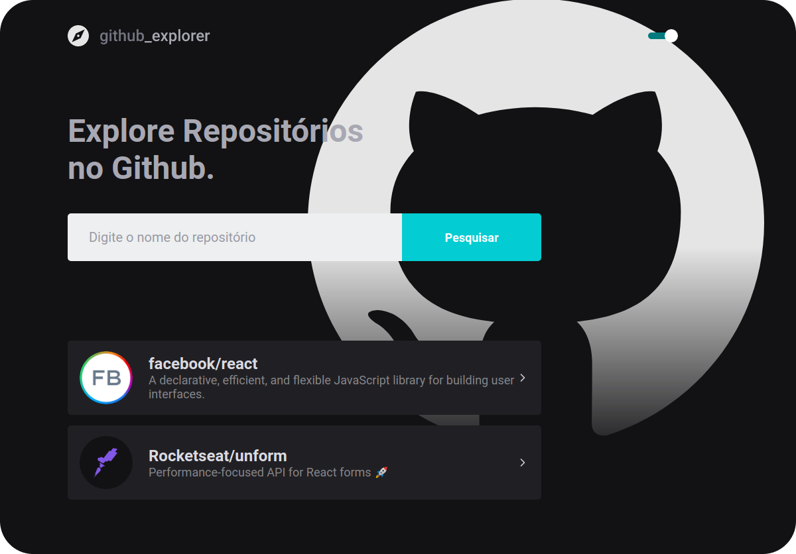

<h1 align="center">Github Explorer</h1>

<p align="center">
  <a href="https://www.linkedin.com/in/helitonoliveira/">
    
  </a>

  

  <a href="https://github.com/heliton1988/happy/stargazers">
    
  </a>
</p>

<p align="center">
  <a href="#memo-sobre">Sobre</a>&nbsp;&nbsp;&nbsp;|&nbsp;&nbsp;&nbsp;
  <a href="#arrowdown-como-baixar-o-projeto">Baixe o projeto</a>&nbsp;&nbsp;&nbsp;|&nbsp;&nbsp;&nbsp;
  <a href="#pagefacingup-licença">Licença</a>
</p>

<h1>
  
</h1>

<h1>
  
</h1>

<br /><br />


<p  align="center">
  Vídeo demo<br/>
  <a href="https://youtu.be/XzqVy9ccoqo">
    
  </a>
</p>

# :memo: Sobre

O Github Explore é uma aplicação que desenvolvi no decorrer das aulas do `bootcamp goStack da Rocketseat`.

# 💄 Milha extra

Fui um pouco além do que foi ensinado na aula e fiz alguma alterações;

✅ Alteração das cores<br />
✅ Implementar Dark mode<br />
✅ Paginacão da lista de issues<br />
✅ Selecionar quantos itens por página<br />
✅ Deploy da aplicação <br />

# :wrench: Tecnogias utilizadas

- [ReactJS](https://pt-br.reactjs.org/)
- [TypeScript](https://www.typescriptlang.org/)
- [Styled Componts](https://styled-components.com/)
- [polished](https://polished.js.org/)
- [Axios](https://github.com/axios/axios)
- [ESlint](https://eslint.org/)
- [EditorConfig](https://editorconfig.org/)
- [Prettier](https://prettier.io/)


# :arrow_down: Como baixar o projeto

```bash

# Clone o projeto
$ git clone https://github.com/helitonoliveiraa/github-explorer.git

# Acesse a pasta do projeto
$ cd github-explorer

# Atualiza todas as dependências
$ yarn / npm install

# Tode o projeto
$ yarn start / npm run start

```


# :page_facing_up: Licença

Esse projeto está sob a licença MIT. Veja o arquivo [LICENSE](https://github.com/heliton1988/happy/blob/master/LICENSEE) para mais detalhes.

<br /><br />

<p align="center">Feito com 💛 by <a href="https://www.linkedin.com/in/helitonoliveira/" target="_blank">Héliton Oliveira</a></p>
